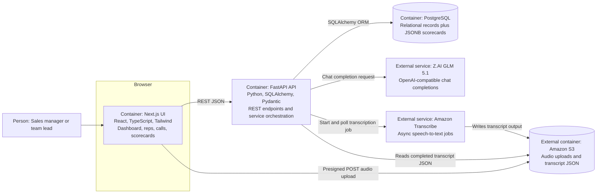

# Architecture

RevenueCoach AI is a three-tier web application with an external AI/audio processing boundary. The Next.js frontend handles dashboard, rep, and call workflows. The FastAPI backend owns the REST API, relational data model, AI analysis orchestration, and AWS transcription integration. PostgreSQL stores reps, calls, transcripts, and structured scorecards.

## Container Diagram

## Runtime Flow

### Transcript Analysis

1. The user creates a rep and call record from the Next.js UI.
2. For transcript-first calls, the frontend posts call metadata and transcript text to `POST /calls`.
3. The user triggers `POST /calls/{call_id}/analyze`.
4. FastAPI loads the call, sends the transcript through `SalesAnalyzer`, and either calls GLM 5.1 or returns a mock result when mock mode is enabled.
5. The call status moves to `analyzing` while the backend processes the transcript.
6. The AI response is parsed into Pydantic models, stored in the `call_analyses` table, and returned to the UI as a scorecard.
7. The call status moves to `analyzed`. Repeated analysis requests return the existing scorecard to avoid duplicated model output.
8. The dashboard reads aggregate metrics from `/dashboard/overview`.

### Audio Upload and Transcription

1. The frontend requests `POST /calls/upload-url` with the file name and MIME type.
2. FastAPI returns a time-limited S3 presigned POST form.
3. The browser uploads the audio file directly to S3.
4. The frontend creates the call record and asks FastAPI to start transcription with `POST /calls/{call_id}/transcribe`.
5. FastAPI starts an Amazon Transcribe job and stores the job id on the call.
6. The call detail page polls `GET /calls/{call_id}/transcribe/status`.
7. When transcription completes, FastAPI reads the transcript JSON from S3 and persists transcript text to the call.
8. The user can then trigger the same AI analysis flow used by transcript-first calls.

### Deletion Flow

1. The user or API client calls `DELETE /calls/{call_id}`.
2. FastAPI deletes linked audio and transcript artifacts from S3 when the call has an audio key or transcription job id.
3. The call row is deleted, and the related `call_analyses` row is removed through ORM cascade behavior.
4. The endpoint returns `204 No Content` after storage and database deletion complete.

## Lifecycle Model

Calls use explicit status values so asynchronous audio and AI work can be retried and debugged:

- `created`: call record exists, but no transcript is ready.
- `transcribing`: Amazon Transcribe job has been started.
- `transcribed`: transcript text is persisted and ready for analysis.
- `analyzing`: AI scorecard generation is in progress.
- `analyzed`: scorecard is persisted.
- `failed`: transcription or analysis failed; `failure_reason` captures the operational detail.

## Deployment Shape

Local development uses Docker Compose:

- `frontend`: Node 20 Alpine image running the Next.js development server on port `3000`.
- `backend`: Python 3.12 image running Uvicorn with reload on port `8000`.
- `db`: PostgreSQL 16 Alpine on port `5432` with a named volume.

The backend image runs `alembic upgrade head` before starting Uvicorn. The application still has a `create_all` fallback for local development, but Alembic is the documented schema path.

The frontend can also be exported as static files for Cloudflare Pages. `frontend/next.config.js` uses static export settings, and `frontend/wrangler.toml` points Cloudflare Pages at the `out` build directory. This deploys only the browser app; `NEXT_PUBLIC_API_URL` must point to a separately deployed FastAPI backend.

External dependencies are not provisioned by Compose. Real AI analysis requires Z.AI configuration, and the audio flow requires AWS credentials, an S3 bucket, bucket CORS policy, and Amazon Transcribe permissions. Production backend deployment is listed on the roadmap, but this repository does not yet include Terraform, ECS/Fargate configuration, managed secrets, or production CORS policy.

## Key Constraints

- Startup schema creation still exists as a local fallback, but Alembic migrations are checked in and used by the backend container.
- The app creates a default organization and does not implement authentication, authorization, or tenant isolation.
- Development CORS is permissive.
- The backend avoids handling raw audio bytes, but it does read transcription output from S3 after Amazon Transcribe completes.
- The AI contract depends on strict JSON prompting and Pydantic validation rather than provider-native structured output enforcement.
- `MOCK_AI=true` is useful for local development but can hide provider or prompt failures until a real API key is used.
